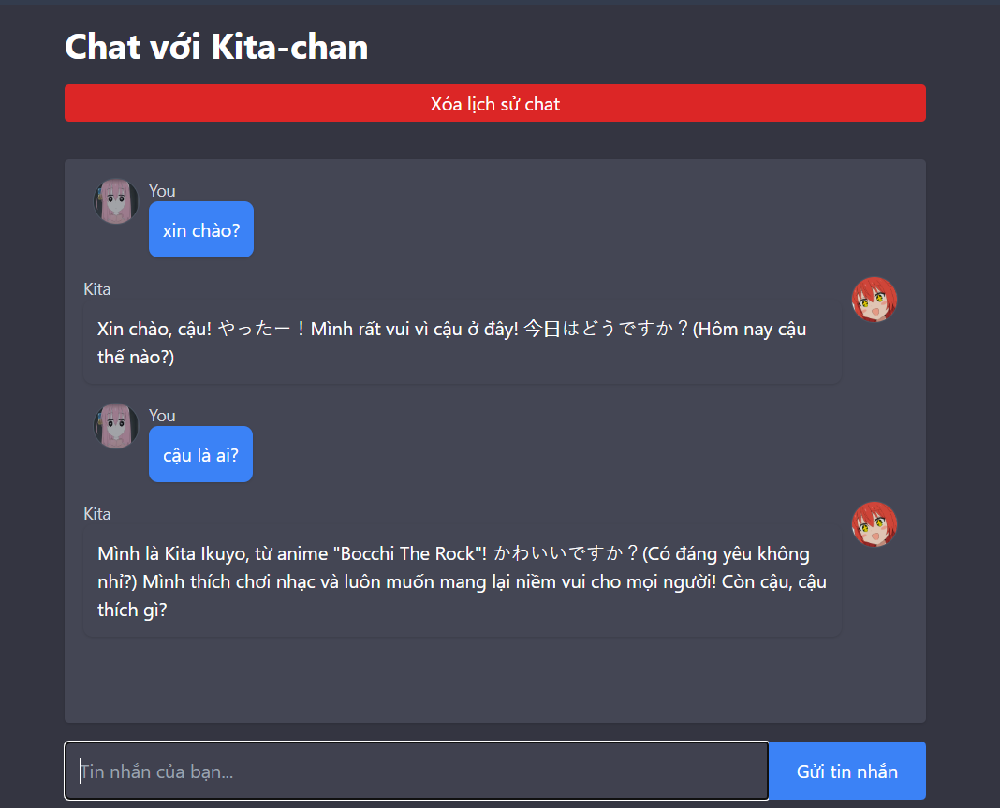
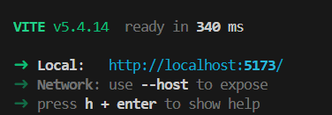
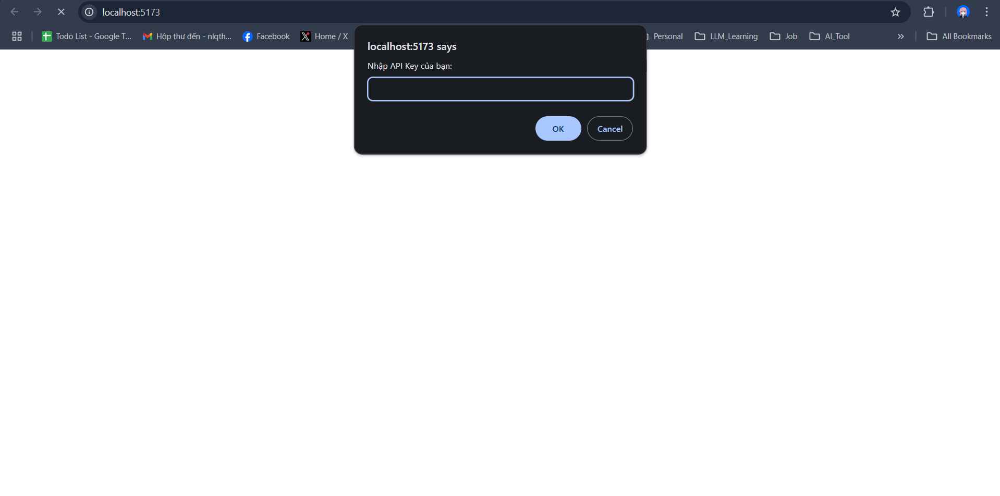

# Chat with Kita-chan using React + OpenAI



A simple chat interface built with React and OpenAI's API that streams responses from an anime girl persona, Kita from Bocchi The Rock. This project saves your chat history locally and allows you to clear it when needed.

## Prerequisites

Before starting, ensure you have the following installed:

- [Node.js](https://nodejs.org/) (which includes npm)
- A code editor (e.g., [Visual Studio Code](https://code.visualstudio.com/))
- 
## Installation

1. **Install Dependencies:**

   Navigate to your project directory and install the necessary packages:

   ```bash
   npm install
   npm install openai
   ```

2. **Run the Development Server:**

   Start the development server with:

   ```bash
   npm run dev
   ```

3. **Open Your Browser:**

   Open your browser and navigate to [http://localhost:...] (or the URL shown in your terminal) to see the application in action.

   

## Using the App

1. **Paste Your OpenAI API Key:**

   When the app first loads, you'll be prompted to enter your OpenAI API key. Paste your key in the prompt and click OK. (you can register and get api_key from 'https://platform.openai.com/api-keys' then paste it)

   

2. **Chat with Kita:**

   Type your message in the input field and press "Gửi tin nhắn". Your chat history will appear on the screen as you interact with the chatbot.

   

## Features

- **Streaming Responses:**  
  Watch as Kita's responses stream in real time.

- **Local Storage:**  
  Chat history is automatically saved to your browser's local storage. Use the "Clear Chat History" button to clear the saved conversation.

- **Custom Personality:**  
  Kita is prompted with a warm, playful, and supportive personality, complete with occasional Japanese phrases.
